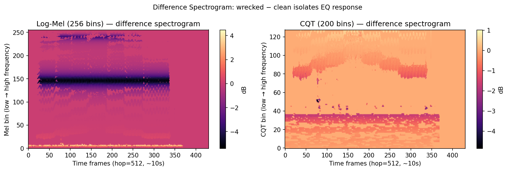
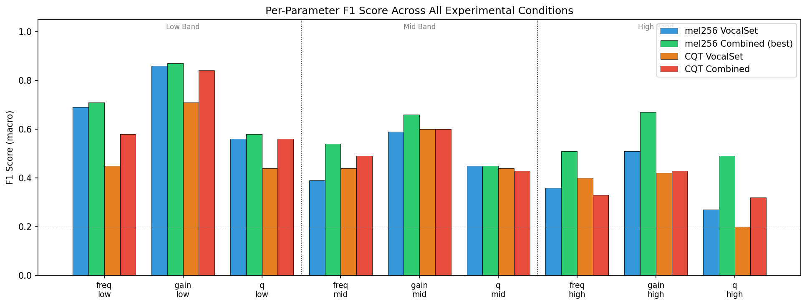
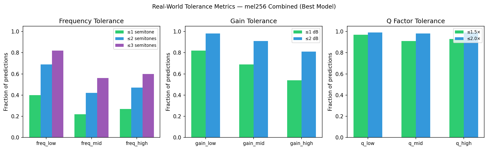

# AutoEQ: Teaching a CNN to Hear Like an Audio Engineer

**CSE 404 Final Project, Michigan State University**
Maxim Meadow · Mayank Gudi · Chaz Eden · Caleb Blackwell · Chase Nomer

📄 **Paper:** [`paper/AutoEQ_CSE404_Paper.pdf`](paper/AutoEQ_CSE404_Paper.pdf)

AutoEQ is a convolutional neural network that predicts the nine parameters of a three-band parametric equalizer from vocal audio. The parameters are center frequency, gain and Q-factor for each of the low (60–300 Hz), mid (300–3000 Hz) and high (3000–16000 Hz) bands. Given a clean recording and an EQ-processed version of it, the model reads the difference spectrogram and outputs nine values you can enter directly into any standard EQ plugin.



---

## Paper

The full write-up is in [`paper/AutoEQ_CSE404_Paper.pdf`](paper/AutoEQ_CSE404_Paper.pdf). Its main contributions are:

- **Architecture.** A lightweight CNN backbone with CBAM attention after each of four convolutional blocks. The first two blocks use asymmetric, frequency-oriented (5×1) kernels, and three independent heads each predict one band.
- **Gain-masked weighted MSE loss.** When a band's gain is near 0 dB, the filter is inaudible, so the loss down-weights that band's frequency and Q errors.
- **Combined dataset.** 5,433 clips: 4,655 from VocalSet 1.2 plus 778 MedleyDB 2.0 vocal stems. Adding MedleyDB reduces MSE by 41% compared with VocalSet alone.
- **Ablations and metrics.** A comparison of log-mel (256 bins) and Constant-Q Transform inputs, plus real-world tolerance metrics in semitones, dB and Q ratios.

### Citation

```bibtex
@misc{meadow2026autoeq,
  title  = {AutoEQ: Teaching a CNN to Hear Like an Audio Engineer},
  author = {Meadow, Maxim and Gudi, Mayank and Eden, Chaz and Blackwell, Caleb and Nomer, Chase},
  year   = {2026},
  note   = {CSE 404 course project, Michigan State University},
  url    = {https://github.com/maxwmeadow/AutoEQ}
}
```

---

## Results

All numbers below are on the 1,087-clip test set (60/20/20 split, seed 42).

| Run | Test MSE | Macro F1 |
|-----|---------:|---------:|
| mel256, VocalSet | 0.0274 | 0.52 |
| CQT, VocalSet | 0.0376 | 0.46 |
| **mel256, Combined** | **0.0162** | **0.61** |
| CQT, Combined | 0.0302 | 0.51 |

These are the tolerance metrics for the best model (mel256, Combined):

| Parameter | Within threshold |
|-----------|------------------|
| gain_low | 82% within 1 dB, 98% within 2 dB |
| gain_mid | 69% within 1 dB, 91% within 2 dB |
| freq_low | 69% within 2 semitones |
| q_high | 93% within 1.5× |

Compared with classical baselines on flattened spectrograms, the CNN reaches F1 0.54. Linear regression reaches 0.28, logistic regression with PCA 0.27 and the perceptron 0.25; random chance is 0.20.

High-band prediction is the weakest across every run. At a 22,050 Hz sample rate, nothing above the 11,025 Hz Nyquist limit appears in the spectrogram. This limit comes from the sample rate, not from the architecture. See Sections 5–6 of the paper for the full analysis.

<p>
  
  
</p>

---

## Repository Layout

```
AutoEQ/
├── paper/AutoEQ_CSE404_Paper.pdf   # project paper
├── data/
│   ├── prepare_data.py             # segment audio, apply random EQ, compute difference spectrograms
│   └── dataset.py                  # PyTorch Dataset with label normalization
├── models/
│   ├── cnn.py                      # AutoEQ CNN (CBAM + per-band heads)
│   ├── linear_regression.py        # baseline
│   ├── logistic_regression.py      # baseline (PCA → 200 components)
│   └── perceptron.py               # baseline
├── train.py                        # training loop (gain-masked weighted MSE, mixup)
├── evaluate.py                     # MSE, binned F1/precision/recall, tolerance metrics
├── checkpoints/                    # trained weights and saved test indices
├── figures/                        # figures used in the paper
├── logs/                           # HPCC training logs
└── slurm/                          # SLURM job scripts for MSU HPCC
```

---

## Usage

### Setup

```bash
pip install -r requirements.txt   # install the GPU build of torch if training on GPU
pip install medleydb              # only needed to build the MedleyDB/combined datasets
```

### Data

- Place VocalSet 1.2 at `data/raw/VocalSet1-2/data_by_singer`.
- Place the MedleyDB 2.0 stems at `data/V2`.

Then build the processed dataset:

```bash
python data/prepare_data.py --mode mel256 --dataset combined --workers 16
# --mode {mel256, cqt}   --dataset {vocalset, medleydb, combined}
```

This writes difference spectrograms and a `labels.csv` file to `data/processed_<mode>_<dataset>/`.

### Train and evaluate

```bash
python train.py --data data/processed_mel256_combined --run mel256_combined
python evaluate.py --data data/processed_mel256_combined \
                   --model checkpoints/best_model_mel256_combined.pt --run mel256_combined
```

The training script saves the best checkpoint to `checkpoints/best_model_<run>.pt`. It also saves the test split to `checkpoints/test_indices_<run>.npy`, so evaluation always uses the same held-out clips. Trained weights for the mel256 and CQT combined runs are already in `checkpoints/`.

### Baselines

```bash
python models/linear_regression.py
python models/logistic_regression.py
python models/perceptron.py
```

The baseline scripts read from `data/processed/`. Point that path at a prepared dataset before running them.

### HPCC

The `slurm/` folder contains the job scripts used on MSU HPCC (V100 GPUs) for data preparation and training. Each training run took about 10–15 minutes.
